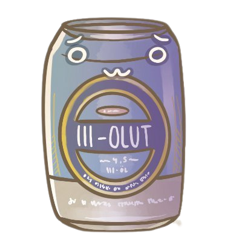

# pirkkabot

> Reporting the important things to the masses



Pirkkabot innocently scans K-Ruoka webstore for Pirkka III -beer's price daily. To combat ever changing CloudFlare and other bot blocking mechanisms used by K-Ruoka, Pirkkabot uses a combination of a managed distrubuted web scraper - [ScrapeOps](https://scrapeops.io/) and BeatuifulSoup to scrape and parse K-Ruoka page contents.

## Latest Tweets

[](https://github.com/gazf/github-readme-twitter)

## Technologies used

- Python
- Tweepy
- SQLite3
- BeautifulSoup :)
- ScrapeOps

## Run Pirkkabot

To run Pirkkabot, populate ScrapeOps API key, run:

```shell
pipenv shell
python3 ./check_price.py
```

## PirkkaDB

As of v1.0.1 Pirkka III-Olut daily price is saved to an SQLite database.
Database backups are handled at the server backend to the off-site NAS server.

## Contributing

If you wish to contribute to Pirkkabot, please create a pull request with a description of your feature/bug fix.

Some things on the to do list are;

- Vercel hosted API that returns price on /api/price GET
- Drawing graph on the price data